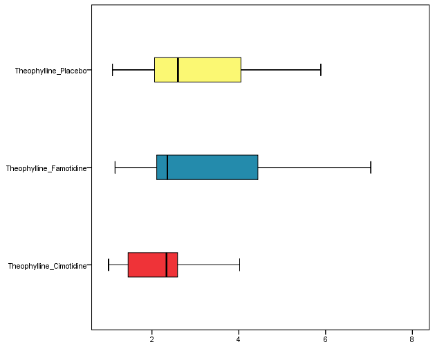

# Master in Pharmacy  

## Exercises - Descriptive Statistics

+ The interactions between theophylline and two other drugs (famotidine and cimetidine) were studied in fourteen patients with chronic obstructive pulmonary disease (Bachmann, et al., 1995). Of particular interest were the pharmacokinetics of theophylline when it was being taken simultaneously with each drug. The study was conducted in three periods: one with theophylline
and placebo, a second with theophylline and famotidine, and the third with theophylline and cimetidine. One outcome of interest is the clearance of theophylline (liters/hour). The data are given in the next Table. The first 8 individuals are men and the next ones are women. 

Table: Theophylline clearances (liters/hour) when drug is taken with interacting drugs

**Exercise 1** Classify the variables.

Click Here to see the answer

Theophyline in Cimetidine, Famotidine and Placebo groups, are a quantitative, continuos variables with a ratio scale.

Gender: Qualitative with a nominal scale.

 

**Exercise 2**: Construct the data base in SPSS.

**Exercise 3**: Get a summary statistics to describe the data.

Click Here to see the answer

 

**Exercise 4**: 
Get parallel boxplots to compare the three groups

Click Here to see the answer

 

**Exercise 5**: Compare the means of Theophylline in cimetidine group for man and woman using a plot. Use another plot to compare the means of Theophylline in all groups.

Click Here to see the answer

 

**Exercise 6**: 
Check if there is any correlation between Theophylline values in the different groups. Use an adequate statistic and plot.

Click Here to see the answer

 

